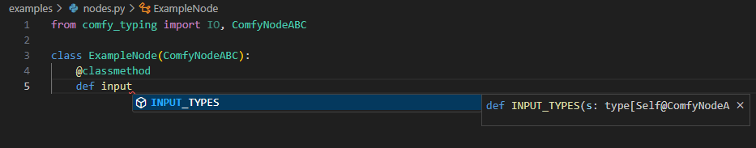
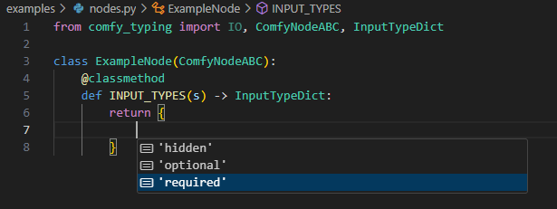
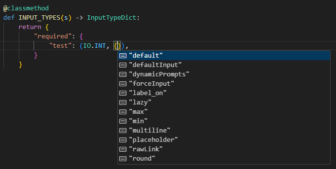

# Comfy Typing
### Type hinting for ComfyUI Node development

This extension provides type hinting and concrete convenience types for node developers.
If cloned to the custom_nodes directory of ComfyUI, types can be imported using:

```python
from comfy_typing import IO, ComfyNodeABC, CheckLazyMixin

class ExampleNode(ComfyNodeABC):
    @classmethod
    def INPUT_TYPES(s) -> InputTypeDict:
        return {"required": {}}
```

Full example is in the `examples` dir.

## Visual Studio Code

The Microsoft python extension can take advantage of the type hinting and autocompletion.  Simply add the paths ComfyUI already uses:

#### User settings (settings.json)
```json
{
    "python.analysis.extraPaths": [
        "C:/ComfyUI/",
        "C:/ComfyUI/custom_nodes/",
    ],
}
```

## Types
A few primary types are documented below.  More complete information is available via the docstrings on each type.

### IO
A string enum of built-in and a few custom data types.  Includes the following special types and their requisite plumbing:
- ANY: "*"
- NUMBER: "FLOAT,INT"
- PRIMITIVE: "STRING,FLOAT,INT,BOOLEAN"

### ComfyNodeABC
An abstract base class for nodes, offering autocomplete and somewhat-alright docstrings.

#### Type hinting / auto-complete
Type hinting for `INPUT_TYPES`


`INPUT_TYPES` return dict


Options for individual inputs

